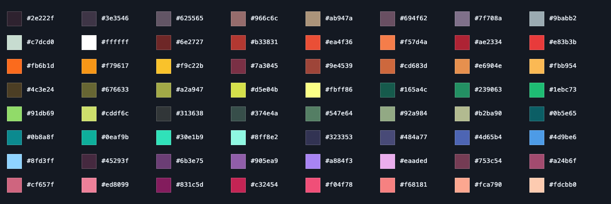

# DELVE — style guide

Classic 2D pixel-art miner, moody underground cave. The single source of truth
for the art. All art is drawn in code (canvas, no images/emoji/fonts-as-art) on
a **logical-resolution buffer that is upscaled with `image-rendering: pixelated`**,
so every effect — including gradients, glows and vignette — stays chunky pixels.

> **Status:** the cave art direction below is developed and tuned in
> `style-lab.html` (the standalone art lab). It has **not yet been ported into
> the game** — `index.html` still renders an earlier flat-tile look. When the
> renderer is ported, the game must be brought in line with this spec. Keep this
> file in sync with `style-lab.html` as the direction evolves.

## Grounding
Derived from studying real references the user vetted: **Dome Keeper**,
**SteamWorld Dig**, **Super Motherload**, Quintino "Deep Cave", BigManJD — on the
**Resurrect 64** Lospec palette. Hard-won principles:
- Blocky isn't the enemy; *flat, unlit* rock is. Tactile rock reads great.
- **Dark mass centers + a lighter background** are what separate foreground rock
  from open/dug space. This is the #1 lever.
- Edges must connect **globally** (a per-pixel field), not per-tile, or they
  misalign; AO/outline must hug the real pixel contour, not the tile box.
- Render all lighting at logical resolution, then upscale — never smooth gradients.

## Layers (composited bottom-to-top)
1. **Background** — a lighter, cooler, desaturated atmospheric wall (own palette),
   with a depth gradient + faint distant-rock silhouettes. Drawn first. Open/dug
   tunnels reveal it. Built to accept **parallax** layers later.
2. **Foreground rock** — the diggable solid, composited on top with transparency
   for open space, plus a subtle **contact shadow** where rock meets the bg.
3. **Overlays** — ore veins, stalactites/stalagmites, the miner, the lamp glow,
   and a vignette.

## Foreground rock model (per-pixel field)
- Rock solidity is a **per-pixel field**: a tile is solid, then its boundary with
  open space is eroded by world-space noise (gentle, ~0.4–1.8px) so edges are
  organic and **connect seamlessly** across tiles/corners.
- **Top-lit, dark-bodied.** Brightness falls off from *every* exposed edge (walls
  and undersides included) with a **top-light bias** (up-facing surfaces brightest).
  The interior of any large mass falls to near-black — **dark centers** — which
  both reads as depth and keeps the body calm. The dark body is left **empty**
  (no random grit — it read busy).
- The surface→center transition is **organic, not a color band**: multi-octave
  noise (lumps poke into light, crevices fall to dark) + ordered (Bayer) dithering,
  with sparse crack detail only in the transition band.
- **Rim** is desaturated and varied between the warm rock tone and a grayer rock
  tone — reads as stone, not molten orange. No moss/flora here (see below).

## Base palette — Resurrect 64
Every colour in DELVE is drawn from **Resurrect 64** by Kerrie Lake — a curated
64-colour Lospec palette (<https://lospec.com/palette-list/resurrect-64>). Staying
within it is what keeps the whole game cohesive; new art must pick from this list
(or a `mix()`/`desat()` of these) rather than introducing fresh colours.

The full 64, with swatches (regenerate the image by drawing the list below to a
canvas — see the palette panel in `style-lab.html`):



Hex list, in palette order (copy-paste friendly):
```
#2e222f #3e3546 #625565 #966c6c #ab947a #694f62 #7f708a #9babb2
#c7dcd0 #ffffff #6e2727 #b33831 #ea4f36 #f57d4a #ae2334 #e83b3b
#fb6b1d #f79617 #f9c22b #7a3045 #9e4539 #cd683d #e6904e #fbb954
#4c3e24 #676633 #a2a947 #d5e04b #fbff86 #165a4c #239063 #1ebc73
#91db69 #cddf6c #313638 #374e4a #547e64 #92a984 #b2ba90 #0b5e65
#0b8a8f #0eaf9b #30e1b9 #8ff8e2 #323353 #484a77 #4d65b4 #4d9be6
#8fd3ff #45293f #6b3e75 #905ea9 #a884f3 #eaaded #753c54 #a24b6f
#cf657f #ed8099 #831c5d #c32454 #f04f78 #f68181 #fca790 #fdcbb0
```

## Palette (Resurrect 64 based)
Each depth stratum is a 6-step ramp, `shadow[0] → rim[5]`, drawn from the base
palette above, with a distinct identity so depth reads by colour:
- **Topsoil** (red-brown): `#2e222f #45293f #7a3045 #9e4539 #cd683d #e6904e` — all R64
- **Clay** (warm ochre/tan): `#2a2018 #48371f #6d5230 #8f6b3c #b28a4e #d0aa66` — hand-tuned ochre; R64 has no clean warm-tan mid-ramp, so this stratum is an R64-*spirit* derivation
- **Stone** (cool gray): `#2e222f #3e3546 #625565 #7f708a #9babb2 #c7dcd0` — all R64
- **Deep Stone** (blue): `#2e222f #323353 #484a77 #4d65b4 #4d9be6 #8fd3ff` — all R64
- **Basalt** (violet): `#2e222f #45293f #6b3e75 #905ea9 #a884f3 #eaaded` — all R64

Ramps use `#2e222f` (R64's darkest) as the shadow step. Shading then blends these
toward black and toward the background tone via `mix()`/`desat()`, so on-screen
pixels include intermediate values — R64 is the *source* palette, not a hard
64-colour quantisation. Background wall is derived per-stratum:
`desat(mix(ramp[1], '#4a4864', .64), .52)` — a lighter, cooler, desaturated version,
always lighter than the rock body.

Ore is the only saturated element, so it pops against the muted rock. Each ore has
a `[dark, mid, highlight]` triad and a **crystal shape**. Every shape is drawn
symmetric about its centre within the same `±(r+1)` box, so any ore icon centres
cleanly in a square and they all read at roughly the same size (metals are lumpy,
misshapen nuggets — a per-ore seeded angular wobble, never perfect spheres; gems
are faceted/airier by design):
- Copper `#7a3045 #cd683d #f79617` — nugget · Iron `#3e3546 #7f708a #c7dcd0` — nugget
- Gold `#4c3e24 #f9c22b #fbff86` — nugget · Emerald `#165a4c #1ebc73 #91db69` — prism
- Ruby `#831c5d #f04f78 #f68181` — cluster · Diamond `#0b8a8f #30e1b9 #8ff8e2` — gem
- Mythril `#484a77 #905ea9 #a884f3` — shard

## Ore veins (chip to reveal)
- Undamaged rock shows **embedded flecks** of the ore colour — a tight, centred
  cluster. Everything (flecks, cracks, socket, crystal) is clamped to within ~5px
  of the tile centre so it never overflows the tile.
- As the tile takes damage: cracks appear early; past ~⅓ damage a **socket** chips
  open and the **crystal grows** (its per-type shape). Fully mined → tile becomes
  open (reveals background). A soft additive glow scales with the reveal.

## Lighting
Dark cave lit by the miner's **lamp** (warm radial glow, pixelated) and framed by a
**vignette** — both drawn at logical res. Unexplored rock is intentionally dark;
lamp reach defines what's visible (tune lamp radius / ambient floor in-game). The
**Ore Scanner** tech reveals ore through rock; the **Deep Lantern** widens the lamp.

## Miner
Small sprite with a dark cool outline: orange helmet + lamp, visor, blue overalls,
boots, and a pickaxe over the shoulder. Sits smaller inside the tile so the scene
breathes.

## Surface decoration (planned)
Moss/grass/flora belong to a future **procedural surface-decoration pass** layered
on top of the rock — applied *selectively* (e.g. only on undisturbed surfaces), not
baked into the rim (freshly-mined rock shouldn't be mossy). Each stratum's `accent`
colour is reserved as an input for this.

## Motion & juice (game layer)
- Nothing teleports: the miner lerps between tiles; the lamp glow pulses.
- Chipping rock: small chip particles + a tiny directional shake.
- Breaking rock: chip burst + shake scaled to ore rarity. **Ore sells the instant
  it breaks, in place** — a rising `+N` coin floaty in the ore's colour, no travel.
- Rich vein (Fortune crit, 3× value): a gold `+N!` floaty, extra sparkle, bigger
  shake, bright chime — the reward beat, overspent on purpose.
- No cargo, no hauling: the loop never asks the player to stop digging.

## Sound (Web Audio, synthesized)
Rising pitch = good, falling = bad; brighter = rarer. Dig = short filtered noise
thud (pitch drops with depth); break = noise crack; ore = a chime that rises with
rarity; sell = gold arpeggio; buy = confirming blip. One mute switch gates
everything; the `AudioContext` unlocks on first input.
